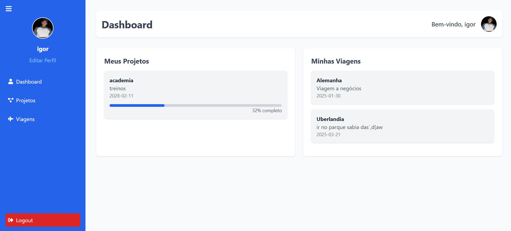
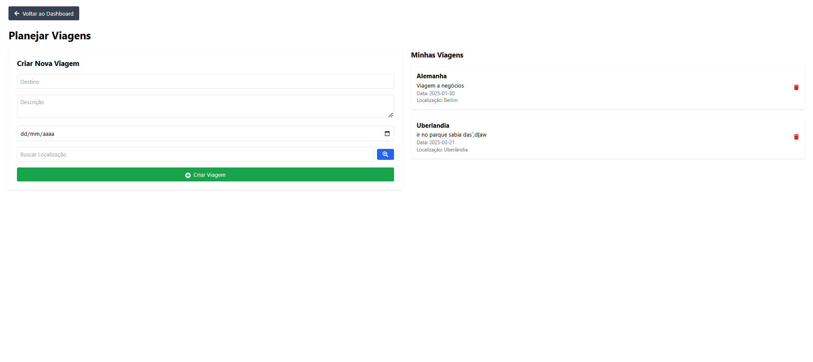
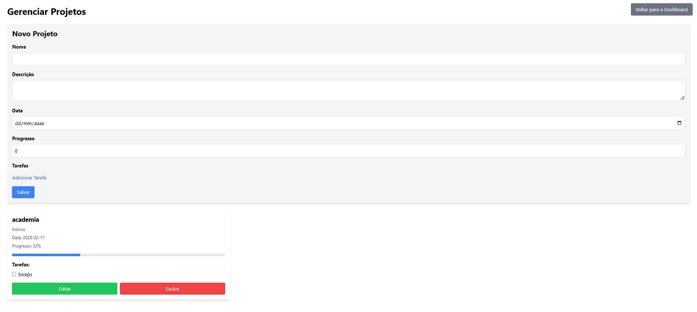
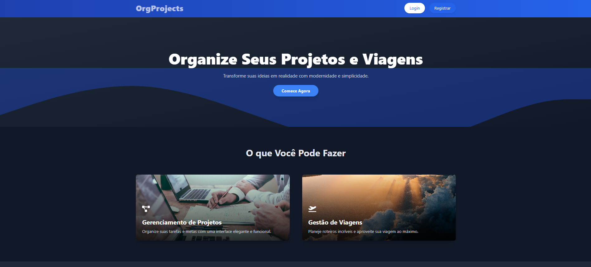

# Projeto de Gestão de Projetos e Tarefas 🚀

Um aplicativo moderno criado para gerenciar **projetos** e **tarefas**, com recursos como CRUD, acompanhamento de progresso, localização de destinos e um dashboard intuitivo.

---

## 📋 **Funcionalidades**

1. **Gerenciamento de Projetos e Tarefas**
   - Criação, leitura, atualização e exclusão de tarefas (CRUD).
   - Acompanhamento do progresso dos projetos.

2. **Viagens e Localização**
   - Adicione destinos e busque cidades específicas utilizando a API da **OpenCage**.

3. **Perfil de Usuário**
   - Troque o nome do usuário.
   - Adicione uma **imagem** ao perfil usando **Cloudinary**.
   - Atualize a senha com segurança.

4. **Dashboard Prático**
   - Visualize projetos e tarefas em um layout limpo e funcional.

---

## 🛠 **Tecnologias Usadas**

- **Frontend**: Next.js, TypeScript, Timeline CSS  
- **Backend**: Node.js  
- **Banco de Dados e Autenticação**: Firebase  
- **APIs**: OpenCage (localização de países/cidades)  
- **Armazenamento de Imagens**: Cloudinary  
- **Testes**: Jest  
- **Containerização**: Docker  

---

## 🚀 **Como Executar o Projeto**

1. **Clone o Repositório**:
   ```bash
   git clone https://github.com/usuario/nome-do-repositorio.git
   cd nome-do-repositorio

Instale as Dependências:

npm install

Configure as Variáveis de Ambiente: Crie um arquivo .env na raiz do projeto e adicione as seguintes chaves:

plaintext
Copiar código
FIREBASE_API_KEY=xxxxxxxx
CLOUDINARY_URL=xxxxxxxx
OPENCAGE_API_KEY=xxxxxxxx

Execute o Projeto em Desenvolvimento:

npm run dev

Testar o Projeto:

npm run test

Rodar com Docker:

docker-compose up

### Dashboard


### Página da Viagem


### Página do Projeto


### Página Inicial


🔗 APIs Utilizadas
Firebase
OpenCage
Cloudinary

🎯 Status do Projeto
✅ Concluído


